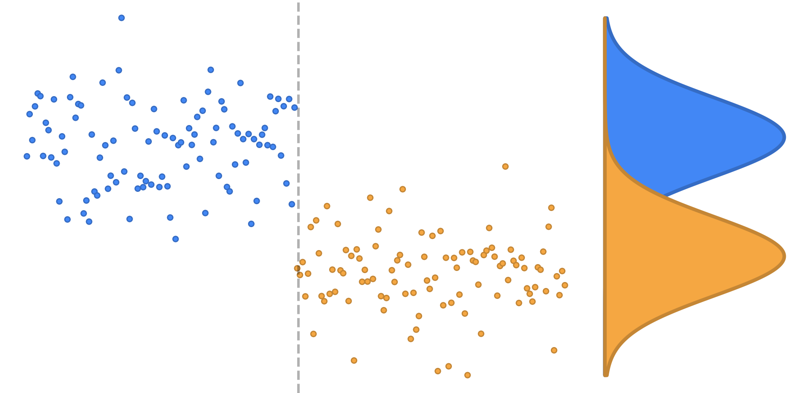

<p align="center">
	
</p>

<h1 align="center">HydroShift</h1>

HydroShift is a web application for reviewing streamflow records from U.S. Geological Survey (USGS) stream gages. It brings together exploratory data analysis, flood-frequency analysis, and changepoint screening so that hydrologists can examine a record, assess potential nonstationarity, and perform flood frequency analyses in one place.

This project fills several gaps in existing tooling:

- Provides a fast, web-accessible interface for exploratory and flood-frequency analysis of USGS gage data.
- Provides a free and open-source option for preliminary analysis when the USACE Time Series Toolbox is unavailable.
- Reviews flood events for a given gage and their surrounding hydrograph to help identify good events for hydrologic and hydraulic model calibration and testing.

## Features

- Look up a USGS gage and review its location, site metadata, drainage area, and hydrologic unit code.
- View annual maximum series (AMS) discharge (and the seasonality of those values), daily flow statistics, and daily and monthly mean streamflow.
- Identify missing observations and periods in which discharge values are qualified as affected by regulation or diversion.
- Fit a Log-Pearson Type III flood-frequency distribution using L-moments, method of moments, or maximum likelihood estimation, with station, regional, or weighted skew.
- Screen an AMS for changepoints and use the identified periods to support a modified flood-frequency analysis.
- Export changepoint results, figures, and tables to a Word report for project reporting.

## Changepoint Analysis

HydroShift applies the sequential changepoint approach described by Ross (2015) to a gage's annual flood-peak record. The analysis compares the distribution of flood peaks before and after each point in the record to identify dates where the behavior of the series may have changed.

Results are presented in two complementary forms. The static analysis evaluates every candidate date across the full record and shows the strength of evidence for a change at that date. The streaming analysis processes the record in sequence; when it identifies a change, it begins a new period for the observations that follow. Together, these views help identify periods that may warrant further hydrologic review or support a modified flood-frequency analysis.

Full descriptions of the tests performed and their results are included in a dynamically-generated report accompanying each changepoint analysis.  Changepoint results are a screening aid, not a substitute for hydrologic judgment or an investigation of the watershed and gage record.

## Setup

### Run with Docker Compose

For local use without development work, HydroShift can be built and run with Docker and Docker Compose. This builds the application image from the repository, including its Python and R dependencies.

Build the image and start the application in the background:

```bash
docker compose -f docker-compose.local.yml up --build -d
```

The application is available at <http://localhost:8501>. Stop it with `docker compose -f docker-compose.local.yml down`.

### Run from Source

HydroShift requires Python 3.12 or later and R. The changepoint analysis uses the R `cpm` package; R dependencies are managed with `renv`.

Create and activate a Python virtual environment:

```bash
python -m venv .venv
source .venv/bin/activate
```

On Windows PowerShell, activate the environment with:

```powershell
.\.venv\Scripts\Activate.ps1
```

Install the Python dependencies and start the application:

```bash
pip install -r requirements.txt
streamlit run hydroshift/streamlit_app.py
```

The application is then available at <http://localhost:8501>.

## Project Layout

- [`hydroshift/`](hydroshift/) contains the Streamlit application, page definitions, analysis utilities, and report templates.
- [`tests/`](tests/) contains statistical-analysis tests.
- [`rserver/`](hydroshift/rserver/) contains the R service used for changepoint processing.
- [`nginx/`](nginx/) contains the reverse-proxy configuration used for container deployment.
- [`Dockerfile`](Dockerfile) and [`docker-compose.yml`](docker-compose.yml) provide container deployment configuration.

## Contributing

We welcome contributors.

- Found a bug? Please report it in the issue tracker.
- Found an issue you would like to fix? Fork the repository, create a focused branch, and submit a pull request.
- Have an idea for a feature? Open an issue so the approach can be discussed.

## Acknowledgements

Work on this tool began when the USACE Time Series Toolbox (TST) was taken offline. Recognizing the need for tools like TST in the community, we set out to provide a free and open-source option for riverine flood statistical changepoint analysis when TST is unavailable.

During development of the changepoint analysis features, we recognized that the ability to perform exploratory data analysis and modified flood frequency analyses alongside a changepoint analysis would drastically improve the utility of this tool for practicing hydrologists and engineers.  HydroShift incorporates methodology and tooling from USGS PEAKFQ and USGS Bulletin 17B to support that workflow.

Thank you to all the USGS staff, USACE staff, and researchers who made the implementation of a tool like this more or less turnkey.  This project stands on the shoulders of giants.

## References

- Gordon J. Ross. 2015. [Parametric and Nonparametric Sequential Change Detection in R: The `cpm` Package](https://www.jstatsoft.org/v66/i03/). *Journal of Statistical Software*, 66(3), 1-20.
- U.S. Army Corps of Engineers. [Time Series Toolbox](https://resilience.sec.usace.army.mil/tst_app/).
- U.S. Geological Survey. [National Water Information System](https://waterdata.usgs.gov/nwis).
- U.S. Geological Survey. [PEAKFQ](https://www.usgs.gov/tools/peakfq).
- Interagency Advisory Committee on Water Data. 1982. [Guidelines for Determining Flood Flow Frequency (Bulletin 17B)](https://doi.org/10.3133/70275162).